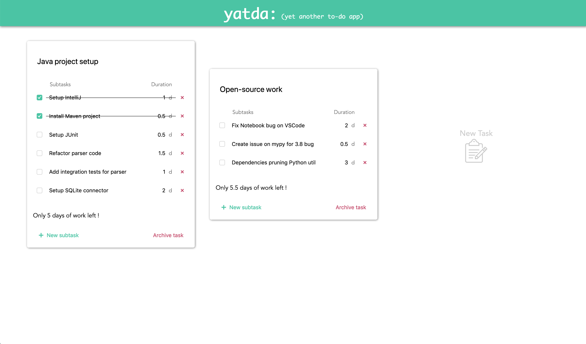

# YATDA : Yet Another To-Do App

YATDA is a simple but useful productivity tool : list the tasks and subtasks that you need to get done, and easily estimate the amount of time needed. Your tasks are always synced with your account, so you can access them on any device.

<kbd></kbd>

## Installation

### Front-end

The front-end is built with [Vue.js](https://vuejs.org/) and Typescript (though I now realize it was a poor choice over plain JS, given the poor support for TS in Vue 2).

To run it, create your own `.env` file based on the `.env.template` example at the root of the _front/_ directory, install the Vue CLI globally via `yarn`, install the project dependencies with `yarn install`, and then `yarn serve` and you're ready to go !

### Back-end

The back-end is built with Python and [Flask](https://flask.palletsprojects.com/en/1.1.x/). I use [Poetry](https://python-poetry.org/) for dependency management, and the database is simply a file-based key-value store using the [shelve](https://docs.python.org/3/library/shelve.html) module from the standard library.

To run it, create your own `config.py` file based on the `config.py.template` example in the _back/yatda/_ folder, install the [Poetry CLI](https://python-poetry.org/docs/#installation), run `poetry install` to install the dependencies, and then execute `./dev.sh` and you're flying !
